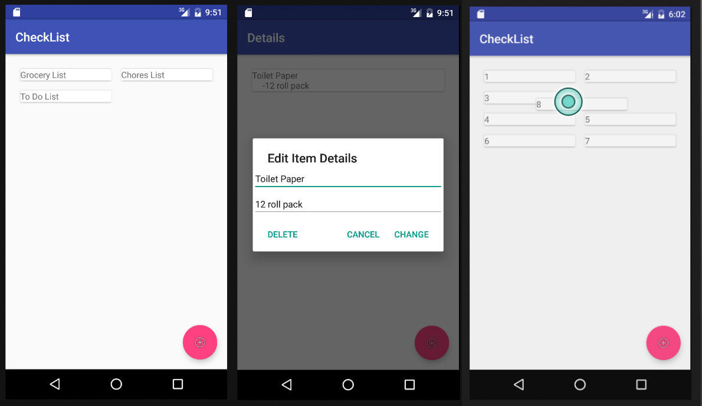

#  Project 1 Redo
##CheckList
###Overview:
I decided to recreate my first project from General Assembly just to see how far I've progressed compared to my [first attempt](https://github.com/chris-shum/GA-Project1).  This app now makes use of RecyclerViews and Dialogs.  I also got to implement <a href = "https://medium.com/@ipaulpro/drag-and-swipe-with-recyclerview-b9456d2b1aaf">Drag and Swipe with RecyclerView</a>.

###Requirements:
- View a collection of to-do lists
- View items on a to-do list, including descriptions
- Allow the user to create a new to-do list
- Add items to each to-do list
- Allow the user to remove items from a to-do list
- Allow the user to remove an entire to-do list
- Use two custom Java objects to contain your data for the To Do Lists, and the To Do Items in each ToDoList
- Show an error message if invalid input is given
- Persist data (your to-do-lists) while the app is open using a singleton

####Bonus:
- Allow the user to check off completed items
- Allow the user to edit previously added items
- Persist data when the app closes and is re-opened

##How to use:

###Main screen:
  The main page is where you create the title of your lists.

  -To add a list title:
  Click on the "+" floating action button, enter the list title and hit add.

  -To edit a list title:
  Swipe list right, follow dialog box instructions.
  
  -To delete a list title:
  Swipe list left or swipe right and click delete.
  
  -To enter list and add items:
  Click on list name.

###In details screen:
The details screen displays the items in your list.

  -To add an item:
  Click on the "+" floating action button, enter the item name and description and hit add.

  -To edit an item:
  Swipe item right and follow dialog box instructions.
  
  -To delete an item:
  Swipe item left or swipe right and click delete.

  
  -To return to main screen:
  Hit back button
  
##Todo:
  - Figure out a better method to save data.  Currently reading up on <a href = "https://realm.io/">Realm.io</a>.

  - Improve design.
  
##Screenshots:
 
